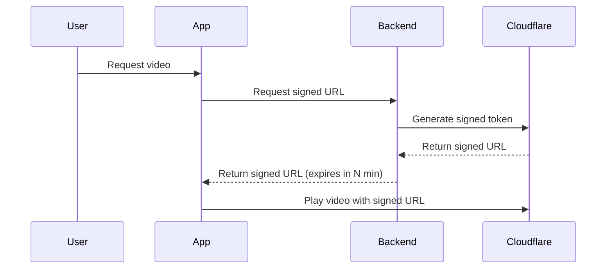
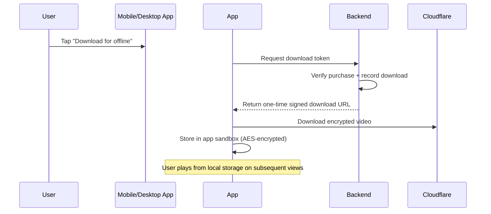

# Video Protection & DRM

> Strategy for securing video content across web, mobile, and desktop platforms — preventing piracy, enabling offline playback, and reducing CDN costs.

---

## Overview

LearnHouse uses a **three-tier video protection strategy** that balances security, user experience, and platform capability. The core philosophy: **make casual piracy impractical** while accepting that the analog hole (camera recording a screen) is unpreventable.

### The Three Tiers

| Tier | Platform | Protection Level | Technology |
|------|----------|-----------------|------------|
| **1 — Web** | Browser | 🟡 Moderate (L3) | Cloudflare Stream signed URLs + dynamic watermarking |
| **2 — Mobile App** | iOS / Android | 🟢 Strong (L1) | `FLAG_SECURE` + encrypted sandbox storage |
| **3 — Desktop App** | Windows / macOS | 🟢 Strong (Hardware) | `SetWindowDisplayAffinity` + PlayReady/FairPlay |

---

## Cloudflare Stream Integration

### Signed URLs (Required)

All video playback must use **signed URLs** with short expiration times. This prevents:

- Hotlinking to video files
- Sharing direct video URLs
- Playback outside authorized sessions



### Dynamic Watermarking

Each video stream overlays the **user's name/email** as a semi-transparent watermark. This:

- Deters sharing of screen recordings
- Makes leaked content traceable to the source account
- Is applied server-side by Cloudflare Stream

---

## Screen Recording Prevention

### What Can Be Prevented

| Attack Vector | Web | Mobile App | Desktop App |
|--------------|-----|-----------|-------------|
| OS-level screen recorder (OBS, QuickTime) | ❌ | ✅ Black screen | ✅ Black window |
| Browser DevTools / inspect element | ❌ | N/A | N/A |
| File system extraction | ✅ Signed URLs | ✅ Sandbox + encryption | ✅ Sandbox + encryption |
| Second camera / external recording | ❌ Unpreventable | ❌ Unpreventable | ❌ Unpreventable |

### Mobile App: FLAG_SECURE

On Android/iOS, the app sets `FLAG_SECURE` on the video playback window. This tells the operating system:

> "Exclude this window from all screen capture and screen recording"

**Implementation:** Use the `@capacitor/privacy-screen` plugin in the Capacitor app.

```typescript
import { PrivacyScreen } from '@capacitor/privacy-screen'

// Enable privacy screen (blocks screenshots + recordings)
await PrivacyScreen.enable()
```

The result: any screen recorder sees a **black screen** when the video is playing.

### Desktop App: WDA_EXCLUDEFROMCAPTURE

On Windows, the desktop app uses the native Win32 API:

```cpp
SetWindowDisplayAffinity(hwnd, WDA_EXCLUDEFROMCAPTURE);
```

This tells Windows: **"This window does not exist for screen capture tools."** OBS, Snipping Tool, Zoom screen share — all see a black hole or nothing.

**In Electron:**

```javascript
mainWindow.setContentProtection(true)
// Or in Capacitor Electron:
BrowserWindow.setContentProtection(true)
```

On macOS, this is handled through FairPlay DRM + the Secure Enclave, which keeps video frames in a protected pipeline that screen recorders cannot access.

---

## Offline Downloads Architecture

### The Dual Benefit

| Benefit | How It Works |
|---------|-------------|
| **Cost savings** | Video downloaded once → played locally N times → zero CDN cost on replays |
| **Offline access** | User can watch without internet — valuable for mobile users |

### Download Flow



### Storage Security

- Videos are stored in the **app's private sandbox** — inaccessible to the user via file manager
- Files are **AES-encrypted at rest** with a device-specific key
- No file extension is stored (can't be opened by external media players)
- HLS segmentation: stored as encrypted `.ts` segments, not a single `.mp4`

### Database Schema

```sql
CREATE TABLE course_downloads (
  id UUID PRIMARY KEY,
  user_id INTEGER REFERENCES users(id),
  course_id INTEGER REFERENCES course(id),
  lesson_id INTEGER REFERENCES activities(id),
  download_token TEXT,  -- one-time token
  expires_at TIMESTAMP,
  downloaded_at TIMESTAMP,
  status TEXT,  -- active | expired | revoked
  device_id TEXT  -- which device downloaded it
);

CREATE INDEX idx_downloads_user ON course_downloads(user_id, status);
```

### Revocation

If a user's access is revoked (refund, subscription lapse):
- Backend sets `status = 'revoked'` for all their downloads
- App checks download status on launch and removes revoked content

---

## Cost Savings Analysis

### Scenario: 1,000 Users, 10 Videos/Course, 30 min/video

| Playback Mode | Data Transfer | Monthly Cost (Cloudflare Stream) |
|--------------|---------------|----------------------------------|
| **Streaming only** (each view = re-stream) | 5,000 hours viewed | ~$5,000/month |
| **Offline downloads** (downloaded once, played 5x each locally) | 1,000 downloads + 0 streaming on replays | ~$200/month (initial downloads) |
| **Savings** | **~96% reduction** | **~$4,800/month saved** |

As the platform grows, savings scale linearly. At 10,000 users, savings exceed **$48,000/month**.

---

## Realistic Threat Model

| Threat | Likelihood | Defense | Effectiveness |
|--------|-----------|---------|---------------|
| User shares video URL | High | Signed URLs (expiring, per-session) | ✅ Fully prevented |
| User downloads & re-uploads | Medium | Signed URLs + sandbox + encryption | ✅ Strongly prevented |
| Screen recording on desktop | Medium | `SetWindowDisplayAffinity` (Electron) | ✅ Prevented |
| Screen recording on mobile | Low | `FLAG_SECURE` | ✅ Prevented |
| Camera recording screen | Very Low | Nothing can prevent this | ❌ Accepted risk |
| Rooted/jailbroken device | Very Low | Root detection + refuse to play | ✅ Detectable |

---

## Key Design Decisions

1. **Accept the analog hole** — Camera recording cannot be prevented by any technology. Focus on blocking the 99% of attacks that matter.
2. **Prioritize mobile + desktop apps** — The web is inherently leaky. Push users toward apps for the best experience + best protection.
3. **Save money with offline** — Offline downloads are not just a feature, they're a cost optimization. Every local playback is a saved CDN bill.
4. **One codebase** — Web, mobile (Capacitor), and desktop (Capacitor Electron) share the same Next.js UI code. Only the protection layer differs.

---

## Related Documents

- [Mobile App Architecture](../mobile-app/mobile-app-architecture.md) — Capacitor-based mobile app
- [Desktop App Architecture](../desktop-app/desktop-app-architecture.md) — Electron desktop app
- [Cloudflare Stream Integration](./cloudflare-stream-integration.md) — Video upload and streaming setup
- [Teacher Payout Plan](../payments/teacher-payout-plan.md) — Revenue sharing
